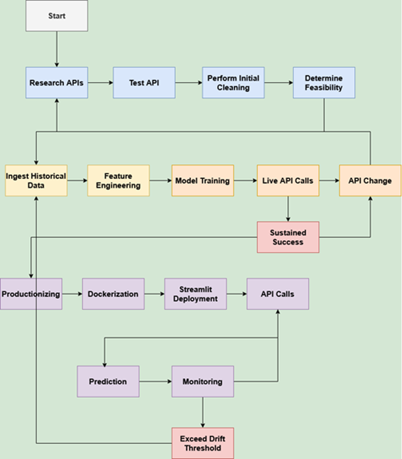

# BTC Price Movement Prediction – Project Documentation

## Overview
This project is an end-to-end machine learning pipeline that predicts the next-hour price movement of Bitcoin using real-time data. It includes:

- Live data ingestion  
- Feature engineering  
- Model training (XGBoost)  
- A Streamlit-based frontend  
- Docker deployment  
- A lightweight model monitoring dashboard  

---

## 1. Process Map  


**Pipeline Steps**  
CryptoCompare API → Feature Engineering → XGBoost Model → Streamlit App → Docker Deployment → Monitoring Dashboard

Each step is modular and designed for retraining, model updates, and scaling.

---

## 2. Data Ingestion  
**Source:** [CryptoCompare API](https://min-api.cryptocompare.com/)

**Data Types:**
- Hourly OHLCV (Open, High, Low, Close, Volume)  
- Real-time price and volume (current data)  
- Frequency: Hourly rolling window  

---

## 3. Predictive Model  
**Model Type:** Binary classification (Up vs Down/Neutral)  
**Framework:** XGBoost  

**Features:**
- Momentum, rolling volatility, SMA-24, SMA-168  
- Return over 1h, 3h, and 6h  
- **Target:** Next-hour close minus current close (i.e., `close[t+1] - close[t]`)  
- **Threshold:** Price increase > $50 → class 1 (up)  

---

## 4. Streamlit Application  
**App File:** `btc_predictor.py`  

**Features:**
- Current hour prediction with confidence  
- Last 10 hourly predictions with actual vs predicted  
- In-progress candle display  
- Live BTC price + 24h change  

---

## 5. Docker Deployment  
Dockerized for platform-independent deployment

```bash
docker build -t btc-app .
docker run -p 8501:8501 btc-app
```

**View app:**
- http://localhost:8501/
  
---

## 6. Monitoring Dashboard (Embedded in App)

The monitoring dashboard is integrated directly into the Streamlit app and provides real-time insights into model behavior.

**Tracks:**
- Recent prediction distribution (↑ vs ↓)
- Average prediction confidence
- Real-time prediction logs
- In-progress data vs model inputs

---

## 7. Risks in Production

**Model Drift**  
Market behavior may change over time (e.g., shifting volatility regimes), causing the model's performance to degrade.

**Data Availability**  
The CryptoCompare API may impose rate limits or change its structure, impacting data ingestion.

**Confidence Misuse**  
Predictions with low confidence might be incorrectly trusted by users, potentially leading to poor decision-making.

**Lag in Real-Time Data**  
Partially formed hourly candles could distort the model’s input, leading to misleading predictions if not handled properly.

---

## 8. Repository Structure

<pre><code>```text bitcoin_mlops/ ├── data/ │ └── btc_hourly_ohlc_.csv ├── data_injestion.py ├── model/ │ └── btc_xgb_classifier.pkl │ └── model_features_train.ipynb ├── docker/ │ └── app.py │ └── requirements.txt │ └── Dockerfile ├── .streamlit/ │ └── config.toml ``` </code></pre>


---

## 9. Getting Started

### Run Locally

```bash
cd app/
docker build -t btc-app .
docker run -p 8501:8501 btc-app
```


